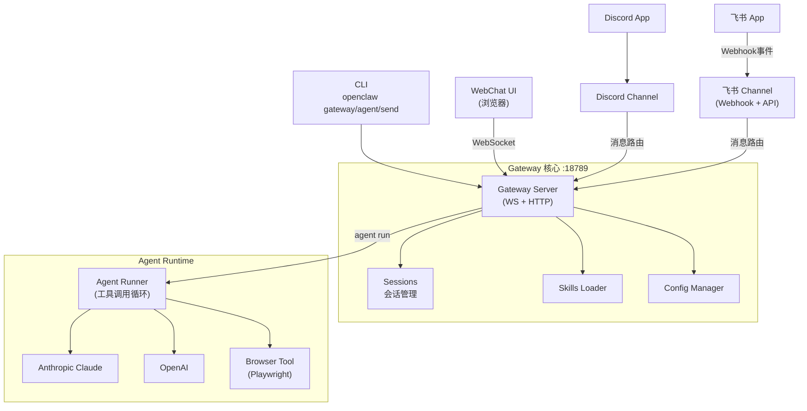

# Mini OpenClaw 构建计划

## 项目定位

复刻 [openclaw/openclaw](https://github.com/openclaw/openclaw) 核心功能的迷你版本 —— 一个运行在本地的个人 AI 助手网关，通过 WebSocket 控制平面连接多个渠道和 AI 模型。

## 技术栈

- **语言**: TypeScript + Node.js (≥22)
- **包管理**: pnpm workspace (monorepo)
- **WS 服务器**: `ws` + `express`
- **AI 模型**: `@anthropic-ai/sdk` + `openai`
- **Discord**: `discord.js`
- **飞书**: `@larksuiteoapi/node-sdk`
- **浏览器控制**: `playwright`
- **CLI**: `commander`
- **Schema**: `zod`
- **构建**: `tsup`

## 目录结构

```
MiniOpenClaw/
├── packages/
│   ├── core/          # 共享类型、WS 协议定义、Config schema
│   ├── gateway/       # WebSocket 服务器 + HTTP 服务（含 WebChat 静态文件）
│   ├── agent/         # AI Agent 运行时（模型适配器 + 工具调用）
│   ├── channels/
│   │   ├── discord/   # Discord 频道集成
│   │   └── feishu/    # 飞书频道集成
│   └── cli/           # openclaw 命令行工具
├── ui/                # WebChat 前端（HTML + TypeScript）
├── skills/            # 内置 Skills（SKILL.md 格式）
├── pnpm-workspace.yaml
├── tsconfig.json
└── package.json
```

## 架构图




## WS 协议（简化版）

与原版一致的 JSON frame 格式：

- 请求: `{ type: "req", id, method, params }`
- 响应: `{ type: "res", id, ok, payload | error }`
- 事件: `{ type: "event", event, payload, seq }`

关键方法: `connect`, `agent`, `send`, `sessions.list`, `sessions.history`, `health`

## 各模块职责

- `**packages/core**`: 协议类型定义（Zod schema）、Config 接口、Session 接口
- `**packages/gateway**`: Express HTTP 服务 + ws WebSocket 服务器、消息路由、会话存储（内存 + JSON 文件持久化）
- `**packages/agent**`: Agent 循环（流式输出）、Anthropic/OpenAI 适配器、内置工具（browser、sessions）、Skills 加载注入
- `**packages/channels/discord**`: discord.js、DM pairing 安全策略、消息转发到 Gateway
- `**packages/channels/feishu**`: `@larksuiteoapi/node-sdk`、HTTP Webhook 接收飞书事件（机器人被@或私信）、调用飞书消息 API 回复、路由到 Gateway
- `**packages/cli**`: `openclaw gateway`、`openclaw agent --message`、`openclaw message send`
- `**ui/**`: 单页 WebChat，通过 WS 实时收发消息，流式显示 agent 输出
- `**skills/**`: 内置示例 Skill（如 `web-search`）以 SKILL.md 格式定义
- **配置**: `~/.openclaw/openclaw.json`，支持 model、discord token、feishu appId/appSecret/verificationToken、allowFrom 等

## 实现顺序

按依赖关系从底层到顶层逐步构建：

1. 初始化 monorepo 基础设施（pnpm workspace + tsconfig + tsup）
2. `packages/core` — 协议类型 + Config schema
3. `packages/gateway` — WS 服务器 + 会话管理
4. `packages/agent` — AI Agent 运行时（Claude 优先）+ Browser 工具
5. `packages/channels/discord` — Discord 集成
6. `packages/channels/feishu` — 飞书集成
7. `ui/` — WebChat 前端
8. `packages/cli` — CLI 入口
9. Skills 系统 + 内置示例 Skill

